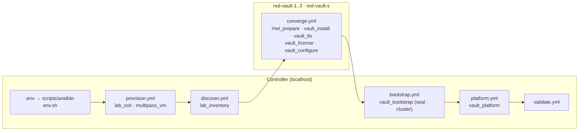
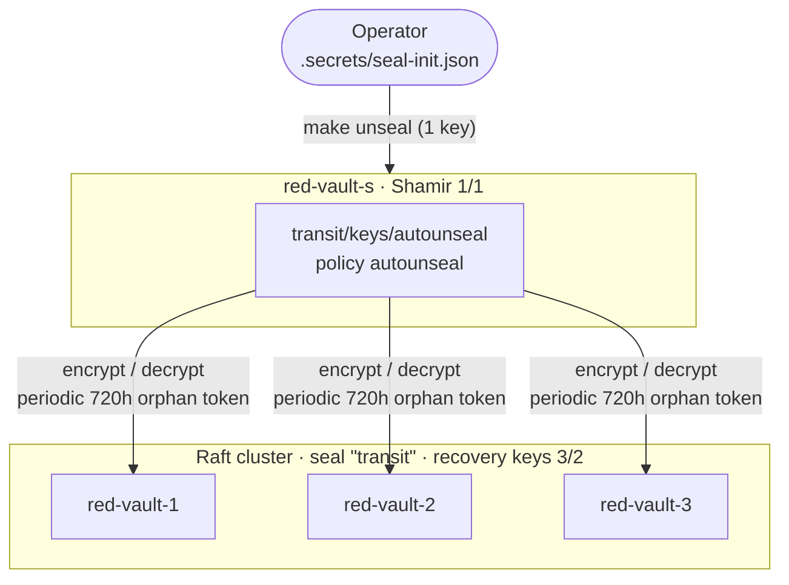
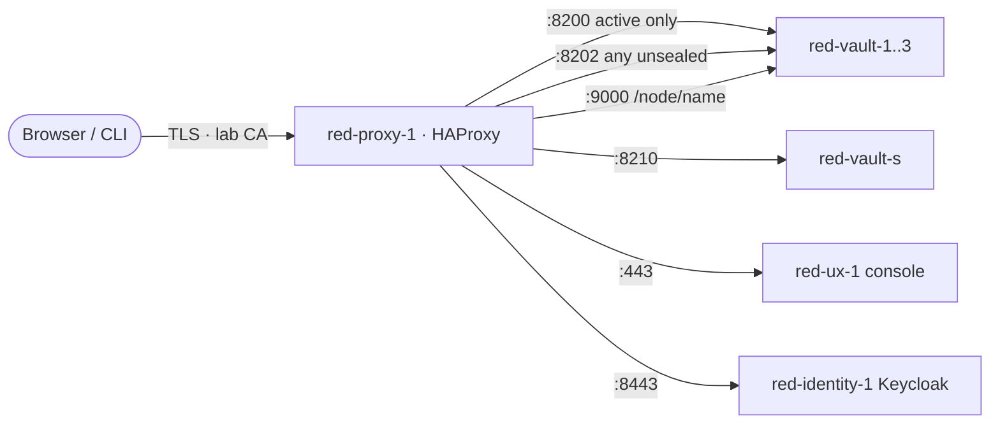
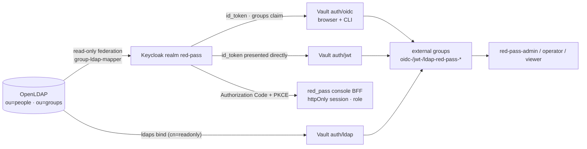

# Architecture

red_pass rebuilds the multi_pass lab with a single automation engine. Every
responsibility Terraform held in multi_pass has an Ansible owner here.

## Ownership: multi_pass → red_pass

| Domain | multi_pass | red_pass |
| --- | --- | --- |
| VM lifecycle | Terraform `todoroff/multipass` | `multipass_vm` role on localhost, driving the Multipass CLI with fixed argv |
| Topology / inventory | Terraform outputs → `extra_vars` | `lab_inventory` role: `multipass list --format json` → `add_host`, filtered by a hard allow-list |
| Ownership evidence | Terraform state | `.build/ownership.json`, written by `provision.yml` |
| Guest OS + Vault | Ansible, triggered by Terraform | Ansible |
| Unseal | Shamir 3/2, operator keys per node | Transit auto-unseal via `red-vault-s` (Shamir 1/1) |
| Namespaces + mounts | Terraform Vault provider | `vault_platform` role via the Vault HTTP API |
| Drift detection | `terraform plan` | `make check-mode` / `make platform-check` (`changed=0` = no drift) |
| "Last converged" | `terraform/ansible` `automation_digest` output | `.build/convergence.json` + `scripts/automation-digest.sh` |

Why no Terraform: in this lab both Terraform layers were thin wrappers around
things Ansible already had to know (VM IPs for SSH, a token for the Vault
API). Removing them removes two state files that had to be kept secret-free,
the provider/first-apply timing problem documented in multi_pass, and the
three-root phase boundary. The cost is that drift detection is check-mode
based and only covers what the roles declare; there is no state graph.

## Playbooks and roles

Every playbook except `provision.yml` imports `discover.yml` first (tagged
`always`), so phases run independently in any order after provisioning.
`site.yml` imports all five; `make lab` runs them one by one
(`scripts/lab.sh`) for clear resume points and writes the convergence stamp.

## The seal chain

1. `red-vault-s` is a standalone single-node Raft Vault with Shamir 1/1.
   `bootstrap.yml` initialises it once, unseals it, enables `transit/`,
   creates the non-exportable key `autounseal`, writes the policy
   `autounseal` (encrypt/decrypt on that key, lookup/renew-self) and creates a
   periodic (720h) orphan token with only that policy.
2. The token reaches each cluster node as `VAULT_TOKEN` in
   `/etc/vault.d/seal.env` (root 0600, systemd `EnvironmentFile`). It is
   never in `vault.hcl`, inventory, or `extra_vars`. Vault renews it itself;
   every `make bootstrap` also renews it and `validate.yml` fails if its TTL
   drops below 72h.
3. Cluster nodes run `seal "transit"` against `https://red-vault-s:8200`
   with the lab CA. They are initialised once with **recovery** keys
   (3 shares / 2), which are never needed for unsealing.
4. `ExecStartPre=/usr/local/bin/vault-wait-seal` checks that the seal Vault is
   active before Vault starts. It fails fast and systemd retries every 10s
   (`Restart=always`), so a sealed seal Vault neither blocks boot nor
   crash-loops Vault, and the node unseals itself seconds after `make unseal`.
5. Only one seal stanza is configured: Seal HA is not part of the licence.

Peer names resolve through `/etc/hosts`. Multipass vendor-data sets
`manage_etc_hosts: true`, so cloud-init rewrites `/etc/hosts` on every boot;
`vault_configure` therefore manages the same block in
`/etc/cloud/templates/hosts.redhat.tmpl` as well.

## Service VMs and the node probe

`red-ux-1` runs the control-plane UI in **VM mode**: it cannot reach the
Multipass daemon, so it never changes VM lifecycle. Its evidence comes from:

- `/var/lib/red-ux/evidence/` — `ownership.json`, `convergence.json`,
  `validation.json` and `automation-digest.txt`, pushed by `ux.yml`
  (`make ux-sync`, last step of `make lab`);
- `/usr/local/libexec/red-pass-probe` on every node (role `lab_probe`): one
  fixed read-only script. The UI runs it over SSH as the unprivileged
  `redprobe`, whose key is `restrict,command="…red-pass-probe",from="<red-ux-1>"`
  — no shell, no forwarding, no other source. Host mode runs the same probe
  through `multipass exec`.

Service VMs get a fourth indicator **Service** (their own unit + HTTPS
health) instead of Vault; cluster and seal-chain evidence are never
attributed to them.

## Front door

- Every backend hop is TLS with `verify required` + `verifyhost <node>`.
- `:8200` checks bare `GET /v1/sys/health`: only the active node answers 200
  (Enterprise performance standbys answer 473), so writes and the Vault UI
  always hit the leader and follow it on failover.
- Keycloak's issuer, Vault's OIDC callbacks and the console's origins switch
  to the proxy URL as soon as `red-proxy-1` is in the inventory
  (`front_door` in `group_vars`), in the same `make lab`.
- The console (3443) and Keycloak (8443) accept only the proxy's address
  (firewalld rich rules). OpenLDAP and Keycloak run with **host networking**:
  Podman's published ports are DNAT'd by netavark and would bypass firewalld.

## Identity

- `auth/jwt` exists because a mount configured with `oidc_client_id`
  refuses direct JWT logins ("unsupported config type").
- Vault external groups carry one alias each, so every directory group has
  one external group per mount.
- The console never sees a token: the Nitro BFF does the code exchange,
  verifies the id_token (issuer, audience, nonce, RS/PS/ES algorithms) and
  keeps only `{name, role}` in an encrypted, httpOnly, secure cookie. VM mode
  refuses every API call without a session (no bypass).
- Keycloak's issuer is fixed (`keycloak_public_url`); prompt 08 moves it to
  the front door.

## Data flow and evidence

| Artifact | Writer | Reader | Contains |
| --- | --- | --- | --- |
| `.build/ownership.json` | `provision.yml` | UI "Ansible provisioned" | names, roles, sizing, IPv4, first_seen |
| `.build/convergence.json` | `scripts/lab.sh` after a fully green run | UI "Ansible converged" | result, timestamps, phases, automation digest |
| `.build/validation.json` | `validate.yml` (also on failure) | UI "Vault secured", humans | pass/fail per node, cluster and seal-chain check |

The automation digest (`scripts/automation-digest.sh`) is a SHA-256 over every
file under `ansible/` and `policies/` plus `ansible.cfg`. If it differs from the
stamp, the lab is converged against an older definition ("outdated").
